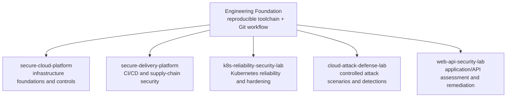

# Day-1 Environment Map

```mermaid
flowchart TD
    F[Engineering Foundation
    reproducible toolchain + Git workflow]
    F --> A[secure-cloud-platform
    infrastructure foundations and controls]
    F --> B[secure-delivery-platform
    CI/CD and supply-chain security]
    F --> C[k8s-reliability-security-lab
    Kubernetes reliability and hardening]
    F --> D[cloud-attack-defense-lab
    controlled attack scenarios and detections]
    F --> E[web-api-security-lab
    application/API assessment and remediation]
```

The repositories are intentionally independent so each can evolve, test, and be reviewed without coupling every change to a single monolith.
