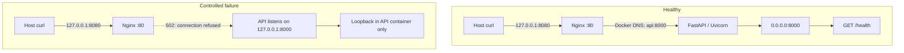
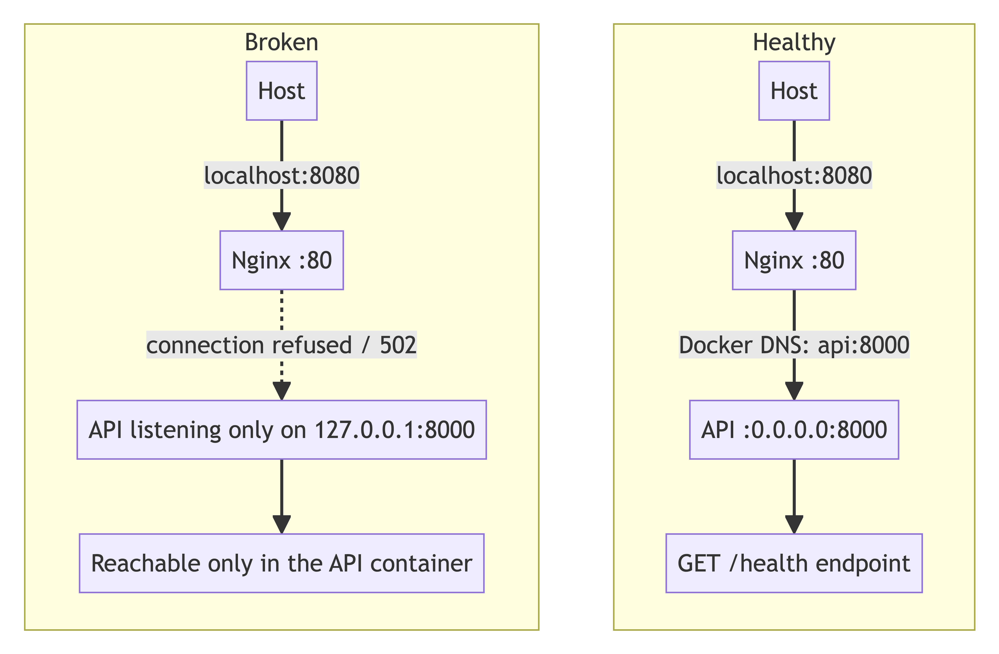

# Day 2 — Service Running but Unreachable

## Incident Summary

In a **controlled local engineering lab**, the FastAPI process remained running and its container-local health check passed, but Nginx returned **HTTP 502 Bad Gateway**. This was not a production incident.

## Architecture

*Rendered from the committed Mermaid diagram source; this is a diagram, not a terminal screenshot.*

## Healthy Baseline

Before fault injection, `curl -v http://localhost:8080/health` returned HTTP 200 and `{"status":"healthy"}`. Compose showed API `Up (healthy)` and Nginx `Up`. Nginx alone published host port 8080; API `8000/tcp` had no host binding.

The fresh rebuild was captured at **2026-10-06 16:44 UTC** in the [healthy baseline](terminal/day-02-healthy-baseline.txt). Later health/status/log checks, the [backend exposure test](terminal/day-02-backend-exposure-test.txt), and [verification-script run](terminal/day-02-verification-script.txt) are preserved separately.

## Failure Injection

At **2026-10-06 15:55:39 UTC**, the API alone was recreated with `API_HOST=127.0.0.1`. The default Compose configuration was not changed. This intentionally demonstrated a process that is alive but unreachable from a peer container.

## Observed Impact

The host connected to Nginx, which returned HTTP 502. Nginx logged `connect() failed (111: Connection refused)` for the API upstream. The API process was still running and its own `/health` request succeeded. The captured [502 and diagnostic excerpts](terminal/day-02-outage-502.txt) come from the actual approved local run.

## Investigation

- **Host → Nginx:** `curl -v http://localhost:8080/health` connected to port 8080 and returned 502, isolating the symptom beyond the host-to-proxy hop.
- **Nginx → API:** Nginx's error log recorded TCP connection refused, with its configured upstream on port 8000.
- **Docker DNS and network:** The failed disposable-peer request used hostname `api` and failed at TCP connect, not name lookup. The Nginx log identified upstream `172.20.0.2`; `docker network inspect` placed the API at that address. After recovery, a separate run explicitly resolved `api` and received healthy JSON.
- **Container state:** Compose showed API `Up (healthy)` and Nginx `Up`; this did not prove cross-container reachability.
- **API → itself:** The API container's request to `127.0.0.1:8000/health` returned healthy.
- **Listener:** `/proc/net/tcp` showed `0100007F:1F40` in LISTEN state, i.e. `127.0.0.1:8000`.

The detailed [incident report](../../operations/day-02-linux-service-outage.md) contains commands, observations, the competing hypothesis table, and exact reasoning. Captured recovery-time peer, self-check, listener, and network output is in [network recovery evidence](terminal/day-02-network-recovery.txt).

## Hypotheses

| Hypothesis | Evidence and verdict |
|---|---|
| DNS failure | Nginx logged an upstream IP; request using `api` failed at TCP connect, not name resolution. **Rejected.** |
| API process failure | Compose showed the API running; Uvicorn completed startup; self-health succeeded. **Rejected.** |
| Wrong port | Nginx targeted 8000 and the API listener used 8000. **Rejected.** |
| Network membership problem | `docker network inspect` showed both services attached to the same Compose network. **Rejected.** |
| Wrong listener interface | Uvicorn announced `127.0.0.1:8000`; socket table showed loopback-only listener. **Confirmed root cause.** |

## Root Cause

The API listened only on **`127.0.0.1:8000` in its own container network namespace**. Loopback is local to that namespace. Nginx runs in a separate container and namespace, so it could not reach that socket through the API container's Docker network interface. A running process and a passing self-check are not proof of service reachability from another container.

## Fix

The listener was restored from **`127.0.0.1:8000` → `0.0.0.0:8000`**. Only the API container was recreated; the temporary override was not committed as the default.

## Recovery Evidence

After recovery, Uvicorn logged `0.0.0.0:8000`; `/proc/net/tcp` showed `00000000:1F40`. A disposable network peer resolved `api` to `172.20.0.2` and returned `{"status":"healthy"}`. Nginx returned HTTP 200, and structured API logs recorded the successful request. See [network recovery evidence](terminal/day-02-network-recovery.txt) and [current recovery transcript](terminal/day-02-recovery.txt).

## Security Boundary Verification

Nginx was reachable at `127.0.0.1:8080`. A host request to port 8000 was refused, and Docker inspection showed API `8000/tcp` mapped to `null`; the backend was not directly published. The [actual exposure-test transcript](terminal/day-02-backend-exposure-test.txt) records both the host probe and port mapping.

## Reproducibility

`docker compose down` followed by `docker compose up -d --build` recreated the fixed default stack. On 2026-10-06, the API became healthy, Nginx started, `/health` returned HTTP 200, and the verification script passed. The stack is currently left in this healthy state. See [fresh build output](terminal/day-02-healthy-baseline.txt) and [verification/log output](terminal/day-02-recovery.txt).

## Engineering Concepts Demonstrated

Process state versus reachability; listening sockets; loopback versus wildcard binding; container network namespaces; Docker DNS; published versus internal ports; reverse proxies; hypothesis-driven troubleshooting; and accurate incident documentation.

## Presentation Support

- [90-second demo script](DEMO_SCRIPT.md)
- [Screenshot capture guide](../SCREENSHOT_CAPTURE_GUIDE.md)
- [LinkedIn post draft](../../social/day-02-linkedin-post.md)
- [LinkedIn asset plan](../../social/day-02-linkedin-assets.md)

## Source Evidence

- [Detailed incident report](../../operations/day-02-linux-service-outage.md)
- [Request-path Mermaid diagram](../../operations/day-02-request-path.mmd)
- [Rendered request-path diagram (PNG)](day-02-request-path.png)
- [FastAPI app](../../../labs/day-02-linux-service-outage/app/main.py)
- [Dockerfile](../../../labs/day-02-linux-service-outage/app/Dockerfile)
- [Compose file](../../../labs/day-02-linux-service-outage/docker-compose.yml)
- [Nginx configuration](../../../labs/day-02-linux-service-outage/nginx/nginx.conf)
- [Verification script](../../../scripts/verify-day-02-service.sh)
- [Actual current verification output](terminal/day-02-verification-script.txt)
- [Compose-model check output](terminal/day-02-compose-config.txt)
- Day-2 engineering commit: `63af047` (`docs: document Day 2 listener outage investigation`); see `git log` for the unaltered Day-1/Day-2 history.
