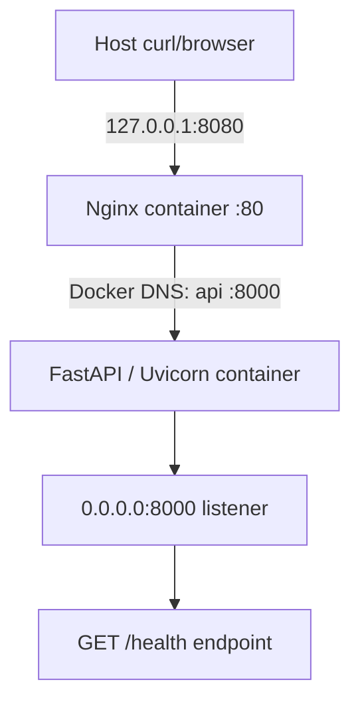

# Day 2 — Linux Service Outage

## Scenario

**Controlled local engineering lab; no production service or users were affected.** The exercise demonstrates why a running API process can still be unreachable from a reverse proxy.

## Repository choice

`secure-cloud-platform` was selected because this is foundational Linux process, container, and network operations work. The Day-1 tree was clean before changes; the exercise lives in `labs/day-02-linux-service-outage/` without reorganizing or overwriting Day-1 files.

## Architecture



The Nginx port is published only on the host loopback interface. The API declares an internal Compose port, not a host-published port.

## Healthy Baseline

Established **2026-10-06 15:46:59 UTC**, before fault injection:

- `docker compose config` validated the service model.
- `docker compose build` completed and `docker compose up -d` started both services.
- `docker compose ps` showed API `Up (healthy)` and Nginx `Up`, with Nginx mapped to `127.0.0.1:8080->80/tcp`.
- `curl -v http://localhost:8080/health` returned HTTP 200 and `{"status":"healthy"}` through Nginx.
- API logs showed Uvicorn on `0.0.0.0:8000` and a structured request event.
- `curl -v http://localhost:8000/health` failed to connect. `docker inspect` showed API `8000/tcp` had no host binding (`null`).

## Symptom

At **2026-10-06 15:55:39 UTC**, the API alone was recreated with `API_HOST=127.0.0.1`. At 15:55:47 UTC, `curl -v http://localhost:8080/health` connected to Nginx but received **HTTP 502 Bad Gateway**. Nginx logged `connect() failed (111: Connection refused)` while connecting to `http://172.20.0.2:8000/health`.

## Impact

Only the local lab's `/health` request through Nginx failed during the controlled test. The API process remained running and its loopback health check passed. No external or production impact occurred.

## Initial Observations

- Host-to-Nginx TCP connectivity worked; Nginx generated an HTTP response.
- Both containers remained running; Compose marked the API healthy because its health check calls loopback from inside that same container.
- Nginx could not establish a TCP connection to the API network endpoint.
- The API's own `http://127.0.0.1:8000/health` returned healthy.
- The API was not published to a host port before, during, or after the incident.

## Investigation

### 1. Reproduce from the client

**Command:** `curl -v --max-time 5 http://localhost:8080/health`

**Why:** Establish the externally visible symptom and distinguish host-to-proxy connectivity from upstream service failure.

**Observation:** TCP connected to host loopback port 8080; Nginx returned HTTP 502. The response was not a client-side connection refusal.

**What this ruled in/out:** Host-to-Nginx was working. Failure was at or beyond Nginx's upstream hop.

### 2. Check container state

**Command:** `docker compose ps -a`

**Why:** Check whether either service had exited or restarted.

**Observation:** API was `Up (healthy)`; Nginx was `Up`.

**What this ruled in/out:** A stopped API process was unlikely. `Up` and the local health check did **not** prove cross-container reachability.

### 3. Read proxy evidence

**Command:** `docker compose logs --no-color --tail=30 nginx`

**Why:** Identify whether Nginx failed to resolve the upstream, timed out, or received a connection error.

**Observation:** `connect() failed (111: Connection refused)` for upstream `http://172.20.0.2:8000/health`; access log recorded 502.

**What this ruled in/out:** Nginx had an upstream address and attempted a connection. Evidence favored an unreachable listener over name-resolution failure.

### 4. Read API evidence

**Command:** `docker compose logs --no-color --tail=30 api`

**Why:** Confirm startup/process state and the address Uvicorn announced.

**Observation:** Startup completed; Uvicorn logged `http://127.0.0.1:8000`. API's own middleware logged a successful `/health` request from its local health check.

**What this ruled in/out:** The process was alive and able to serve locally; the address announcement raised the wrong-interface hypothesis.

### 5. Test each request-path hop

**Host → Nginx command:** `curl -v http://localhost:8080/health`

**Observation:** Host connected; received HTTP 502.

**Nginx/network peer → API service-name command:**

```sh
docker run --rm --network day-02-linux-service-outage_service-net \
  --entrypoint python day-02-linux-service-outage-api -c \
  'import socket,urllib.request; print(socket.gethostbyname("api")); print(urllib.request.urlopen("http://api:8000/health",timeout=2).read())'
```

**Why:** Use a disposable container on the same Compose network rather than installing diagnostic tools in the Nginx image.

**Observation:** Docker DNS resolved `api` to `172.20.0.2`; the connection to port 8000 was refused.

**What this ruled in/out:** Compose service-name DNS worked. A separate network namespace reproduced the connection failure.

**API container → itself command:**

```sh
docker compose exec -T api python -c \
  'import urllib.request; print(urllib.request.urlopen("http://127.0.0.1:8000/health").read())'
```

**Observation:** Returned `{"status":"healthy"}`.

**What this ruled in/out:** The app and loopback listener were functional locally; the failure was not an application crash or broken health handler.

### 6. Inspect listener and Docker network

**Commands:**

```sh
docker compose exec -T api python -c \
  'print("\\n".join(r for r in open("/proc/net/tcp").read().splitlines()[1:] if r.split()[1].endswith(":1F40") and r.split()[3]=="0A"))'
docker network inspect day-02-linux-service-outage_service-net --format '{{json .Containers}}'
docker inspect day-02-linux-service-outage-api-1 --format '{{json .NetworkSettings.Ports}}'
docker inspect day-02-linux-service-outage-nginx-1 --format '{{json .NetworkSettings.Ports}}'
```

**Why:** Verify the actual listening socket, shared network membership, and host port publication.

**Observation:** `/proc/net/tcp` showed `0100007F:1F40` (`127.0.0.1:8000`) in LISTEN state. Both API and Nginx were members of the same Compose bridge network. API ports were `{"8000/tcp":null}`; only Nginx had a host binding, `127.0.0.1:8080` to container port 80.

**What this ruled in/out:** The Docker network existed and both services were attached; the API backend was not host-published. The listener was confined to loopback.

`ss` was not installed in the minimal Python image, so `/proc/net/tcp` was used instead of adding diagnostic packages. `ps` was also absent; process state and command/listener evidence came from Compose state, Uvicorn startup logs, and the socket table. Packet capture was unnecessary because the logs and socket tests were conclusive.

## Hypotheses

| Hypothesis | Evidence for | Evidence against | Verdict |
|---|---|---|---|
| H1 — Nginx cannot resolve service name `api` | Nginx reported an upstream connection error | Nginx logged upstream IP `172.20.0.2`; diagnostic peer resolved `api` to that IP | Rejected |
| H2 — API is not running | Nginx receives connection refusal | Compose showed `Up (healthy)`; Uvicorn completed startup; self-request returned healthy | Rejected |
| H3 — API listens on the wrong interface | Nginx peer connection refused while self-request succeeds | Uvicorn announced `127.0.0.1:8000`; `/proc/net/tcp` showed `0100007F:1F40` | Confirmed; root cause |
| H4 — Nginx targets the wrong port | Upstream connection fails | Nginx configuration and error log target port 8000; listener is on port 8000 | Rejected |
| H5 — Docker network membership is incorrect | Cross-container request fails | Network inspection showed both containers attached; service DNS resolved | Rejected |

## Root Cause

The API process was bound to **`127.0.0.1:8000` inside its own container**. Loopback is local to that container's network namespace. Nginx is a different container with a different network namespace, so a request to the API container's Docker network address (`172.20.0.2:8000`) could not reach the loopback-only socket.

These are distinct states:

- **Process state:** Uvicorn was running.
- **Socket listener:** it accepted connections only on `127.0.0.1:8000`.
- **Network reachability:** another container could not reach that listener through the API container's network interface.

A process being alive—or a self-check being healthy—does not establish that its service is reachable from its intended clients.

## Remediation

The API listener was restored to **`0.0.0.0:8000`**, which listens on all container interfaces. The outage used only a one-command environment override; no broken default was committed. Recovery recreated only the API container with the default environment. Compose retains `API_HOST: ${API_HOST:-0.0.0.0}`, so a clean/default deployment is healthy.

## Verification

After recovery:

- `docker compose ps` showed API `Up (healthy)` and Nginx `Up`.
- `curl -i --fail http://localhost:8080/health` returned HTTP 200 and `{"status":"healthy"}`.
- A disposable peer resolved `api` to `172.20.0.2` and got the healthy response from `http://api:8000/health`.
- API self-test returned healthy.
- `/proc/net/tcp` showed `00000000:1F40`, the wildcard listener on port 8000.
- Uvicorn logged `http://0.0.0.0:8000`; API JSON request logs contained timestamp, level, request ID, method, path, status, and duration.
- Nginx recorded a successful 200 request after the earlier 502.
- `curl http://localhost:8000/health` was refused on the host, and Docker inspection showed `8000/tcp` had no published host binding.

## Prevention

- Bind container services to an address reachable through the container interface, normally `0.0.0.0`, not loopback alone.
- Keep health checks representative of the intended client path; a container-local loopback check can pass while peer clients fail.
- Verify the request path hop by hop and compare process logs with actual listening sockets.
- Publish only the reverse proxy's port; keep backend ports internal to the Compose network.
- Keep a small, reproducible recovery and verification procedure with the service.

## Lessons Learned

- “Running” describes process/container state, not whether the intended client can connect.
- `127.0.0.1` means this network namespace; `0.0.0.0` listens on all local interfaces.
- Docker Compose service names provide stable DNS; container IPs are diagnostic evidence, not configuration.
- A published port maps host traffic into a container. `expose`/internal reachability does not publish a host port.
- Logs show what components report, but socket inspection and independent hop tests verify what they can actually reach.
- Testing host → proxy, peer → service, and service → self isolates the failing boundary much faster than restarting services blindly.

## Commands Used

```sh
docker --version
docker compose version
docker info
docker version
lsof -nP -iTCP:8080 -sTCP:LISTEN
docker compose config
docker compose build
docker compose up -d
curl -v http://localhost:8080/health
curl -v http://localhost:8000/health
docker compose ps -a
docker compose logs --no-color nginx
docker compose logs --no-color api
API_HOST=127.0.0.1 docker compose up -d --force-recreate api
docker compose exec -T api python -c '... self request and /proc/net/tcp inspection ...'
docker network inspect day-02-linux-service-outage_service-net
docker inspect day-02-linux-service-outage-api-1
docker inspect day-02-linux-service-outage-nginx-1
docker run --rm --network day-02-linux-service-outage_service-net ...
docker compose up -d --force-recreate api
docker compose down
docker compose up -d --build
```

## Teardown and Reproducibility

**PASS:** `docker compose down` removed both containers and the Compose network. `docker compose up -d --build` recreated the image/container from the repository. The API reached `Up (healthy)`, Nginx reached `Up`, `scripts/verify-day-02-service.sh` returned the expected JSON and HTTP 200, API host binding inspection returned `{"8000/tcp":null}`, and a host curl to port 8000 was refused. A final `docker compose config --quiet` passed. The running services are left in the healthy state.

## Security / Scope Check

No secrets, credentials, privileged mode, Docker socket mount, hardcoded container IP configuration, or unnecessary host-published backend port were added. Scope remained local Python/FastAPI, Uvicorn, Docker Compose, Nginx, and Linux/network troubleshooting; no cloud infrastructure, Kubernetes, monitoring stack, database, or CI/CD was introduced.
